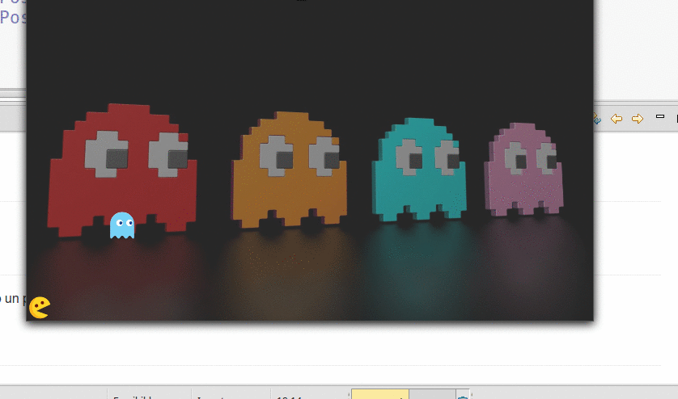

# Pacman!

# Tercera iteración: rivales en movimiento

Por el momento, los rivales están parados, entonces mientras el personaje no vaya hacia sus rivales, éstos no le quitarán vidas. Vamos a hacerlo un poco más interesante.

## Movimiento del rival

El rival debería 

- tratar de acercarse hasta la posición donde está el personaje
- algunos podrían hacerlo más rápido que otros

En el programa, siempre dentro de la creación de rivales, hacemos:

```js
	rivales.forEach { rival => 
        ...
		game.onTick(1.randomUpTo(5) * 1000, {
			console.println("rival " + rival + " se acerca a " + pacman)
			rival.acercarseA(pacman)
		})
	}
```

## Acercamiento del pacman

Para acercarse al pacman, debemos conocer su posición y como estrategia sencilla

- si el pacman está arriba nuestro, iremos hacia arriba
- si el pacman está abajo nuestro, iremos hacia abajo
- si el pacman está a nuestra derecha, iremos hacia la derecha
- o a la izquierda en caso contrario

Dentro de la clase Rival, escribimos

```js
class Rival {
	var property position  // pasa a ser un atributo

   	constructor(_numero) {
		numero = _numero
		position = game.at(numero + 1, numero + 1)
	}

    ...

	method acercarseA(personaje) {
		var otroPosicion = personaje.position()
		var newX = position.x() + if (otroPosicion.x() > position.x()) 1 else -1
		var newY = position.y() + if (otroPosicion.y() > position.y()) 1 else -1
		position = game.at(newX, newY)
	}
```

El método es un poco largo, podemos refactorizarlo luego.

## Demo de cómo quedaría el juego hasta ahora



En el video vemos que hay algunos inconvenientes

- si el personaje no se mueve, la colisión contra un rival hace que pierda el juego porque se repiten 3 colisiones muy rápidamente
- por otra parte, si colisionan dos rivales, esto hace que se produzca un mensaje no entendido: perderVida() solo lo entiende el pacman, no el rival

Vamos a mejorar la experiencia de usuario haciendo un refactor importante de nuestra solución, en el programa ya no vamos a asumir que "perdí una vida" ya que quien se mueve no es solo el pacman, sino también los rivales. Entonces queremos trabajar polimórficamente el hecho de que choquen entre sí:

```js
	rivales.forEach { rival => 
		game.addVisual(rival)
		game.whenCollideDo(rival, { personaje =>
			personaje.chocarCon(rival) // se maneja un método polimórfico
		})
		game.onTick(1.randomUpTo(5) * 1000, {
			rival.acercarseA(pacman)
		})
	}
```

Entonces el pacman al chocar

- pierde una vida
- resetea su posición
- le pide al rival que resetee su posición
- y verifica que el juego no haya terminado

```js
object pacman {
	var property position = game.origin()
	var image = "pacman.png"
	var vidas = 3

	method juegoTerminado() = vidas == 0
	
	method resetPosition() {
		position = game.origin()
	}
	
	method chocarCon(rival) {
		// sin dudas perdí una vida
		vidas--
		// reset de las posiciones
		self.resetPosition()
		rival.resetPosition()
		// agregamos la validación del juego terminado en pacman
		if (self.juegoTerminado()) {
			game.stop()
		}
	}
}
```

Por otro lado, el rival al chocar con otro rival no va a hacer nada. Pero vamos a mejorar la forma de acercarse hacia el personaje para que no caiga en el tablero (no puede bajar de la posición 0 ni excederse el máximo del ancho o alto del tablero):

```js
class Rival {
	const numero
	var property position

	constructor(_numero) {
		numero = _numero
		self.resetPosition()
	}
	
	method image() = "rival" + numero.toString() + ".png"

	method acercarseA(personaje) {
		var otroPosicion = personaje.position()
		var newX = position.x() + if (otroPosicion.x() > position.x()) 1 else -1
		var newY = position.y() + if (otroPosicion.y() > position.y()) 1 else -1
		// evitamos que se posicionen fuera del tablero
		newX = newX.max(0).min(game.width() - 1)
		newY = newY.max(0).min(game.height() - 1)
		position = game.at(newX, newY)
	}
	
	method resetPosition() {
		position = game.at(numero + 1, numero + 1)
	}
	
	method chocarCon(otro) {}
}
```

# La segunda demo

Ahora va pareciéndose a un juego, no?


# Un último chiche

Vamos a evitar que dos rivales colisionen entre sí, para lo cual guardaremos la posición anterior, en caso de que haya colisión con otro rival vamos a respetar que el otro "nos ganó de mano" y volveremos a la posición anterior:

```js
class Rival {
    ...
	var previousPosition

	method acercarseA(personaje) {
        ...
		previousPosition = position
		position = game.at(newX, newY)
	}
	
    ...
	
	method chocarCon(otro) {
		self.resetPreviousPosition()
	}
	
	method resetPreviousPosition() {
		position = previousPosition 
	}
}
```
